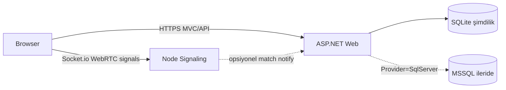

# LinguaTalk — Yabancı Dil Pratik ve Konuşma Platformu

Profesyonel proje iskeleti:

1. **ASP.NET Core MVC** — web arayüzü, üyelik, misafir girişi, veri API’leri  
2. **EF Core** — şimdilik **SQLite** (Mac geliştirme); ileride tek ayarla **MSSQL**  
3. **Node.js + Socket.io** — WebRTC sinyalleşme ve eşleşme kuyruğu  

> Not: Makinede .NET **9** SDK yoktu (kurulu: 8 ve 10). İskelet **net8.0** ile derlenebilir şekilde kuruldu. .NET 9 yükledikten sonra `TargetFramework` değerlerini `net9.0` yapıp paket sürümlerini 9.x’e yükseltebilirsin.

## Klasör yapısı

```text
Cursor Project/
├── README.md
├── .gitignore
└── src/
    ├── LanguagePracticePlatform.slnx
    ├── LanguagePractice.Core/           # Domain entities, enums, interfaces
    ├── LanguagePractice.Infrastructure/ # EF Core, Identity, repositories
    ├── LanguagePractice.Web/            # MVC + API
    └── signaling-service/              # Node.js Socket.io WebRTC signaling
```

## Mimari özet

| Katman | Görev |
|--------|--------|
| `LanguagePractice.Core` | `ApplicationUser`, `UserProfile`, `Language`, `UserLanguage`, `MatchHistory`, `GuestSession` |
| `LanguagePractice.Infrastructure` | `ApplicationDbContext`, Fluent API config, Identity, repository/service DI |
| `LanguagePractice.Web` | Controllers/Views, üyelik + misafir, lobi UI, `api/matches` |
| `signaling-service` | Kuyruk eşleştirme, oda yönetimi, offer/answer/ICE relay |



### Veritabanı geçişi (SQLite ↔ MSSQL)

`appsettings*.json` içinde:

```json
"Database": { "Provider": "Sqlite" },
"ConnectionStrings": {
  "Sqlite": "Data Source=App_Data/linguatalk.db",
  "SqlServer": "Server=...;Database=LanguagePracticeDb;..."
}
```

| Şimdi (Mac) | İleride MSSQL |
|-------------|---------------|
| `"Provider": "Sqlite"` | `"Provider": "SqlServer"` |
| `App_Data/linguatalk.db` oluşur | `ConnectionStrings:SqlServer` değerini doldur |
| Ayrı Docker/SQL Server gerekmez | Yeni migration’ı SqlServer için üret/uygula |

Her iki provider paketi (`Sqlite` + `SqlServer`) projede duruyor; sadece config değişir.

---

## Senin yapman gerekenler (adım adım)

### 1) EF migration (ilk kurulum / model değişince)

```bash
cd "src/LanguagePractice.Web"
dotnet tool install --global dotnet-ef   # yoksa
dotnet ef migrations add InitialCreate --project ../LanguagePractice.Infrastructure --startup-project .
```

Uygulama açılışında `MigrateAsync` SQLite dosyasını otomatik oluşturur; istersen elle:

```bash
dotnet ef database update --project ../LanguagePractice.Infrastructure --startup-project .
```

### 2) ASP.NET web uygulamasını çalıştır

```bash
cd "src"
dotnet run --project LanguagePractice.Web
```

Tarayıcıda `launchSettings.json` adresini aç (ör. `https://localhost:7235`).
DB dosyası: `LanguagePractice.Web/App_Data/linguatalk.db`

**Admin paneli:** `/Admin`  
Varsayılan hesap (`AdminSeed`):

- E-posta: `admin@linguatalk.local`
- Şifre: `Admin123!`

Sadece `Admin` rolündeki kullanıcılar erişebilir (`[Authorize(Roles = "Admin")]`).

### Çoklu dil (Localization)

- 20 UI dili: `Resources/i18n/*.json`
- Otomatik dil: cookie → GeoIP/CDN country header → `Accept-Language`
- Sağ üstte mobil uyumlu dil seçici
- Arapça/Urduca için `dir="rtl"`
- Yeni metin eklemek: `en.json` + ilgili dil dosyalarına anahtar ekle

### 3) Signaling (Node) servisini çalıştır

Ayrı bir terminalde:

```bash
cd "src/signaling-service"
cp .env.example .env
# .env içinde CORS_ORIGIN ve ASPNET_API_BASE_URL değerlerini Web portlarına göre ayarla
npm install
npm run dev
```

Sağlık kontrolü: `http://localhost:5050/health`

### 4) Uçtan uca dene

1. Web’de **Misafir Girişi** veya **Üye Ol**  
2. **Pratik Lobisi** → kamera izni ver → **Kuyruğa Katıl**  
3. İkinci bir tarayıcı/pencere ile aynı dile gir → eşleşme + WebRTC akışı  

---

## Önemli endpoint / event’ler

### ASP.NET API

- `POST /api/matches` — eşleşme kaydı  
- `GET /api/matches/{roomId}`  
- `POST /api/matches/{roomId}/complete`  

### Socket.io event’leri

| Event | Yön | Açıklama |
|-------|-----|----------|
| `queue:join` | client → server | Kuyruğa gir |
| `queue:waiting` | server → client | Eşleşme bekleniyor |
| `match:found` | server → client | Oda + peer bilgisi |
| `webrtc:offer` / `answer` / `ice-candidate` | iki yön | SDP / ICE aktarımı |
| `match:peer-left` | server → client | Karşı taraf ayrıldı |

---

## Sonraki geliştirme önerileri

- Cookie/JWT ile signaling auth  
- Redis tabanlı dağıtık kuyruk  
- TURN sunucusu (NAT arkasında üretim için)  
- Profil düzenleme ve dil seviyesi UI  
- Eşleşme sonrası rating / raporlama  

İskelet bilinçli olarak ince tutuldu; üzerine özellik ekleyerek ilerleyebilirsin.
